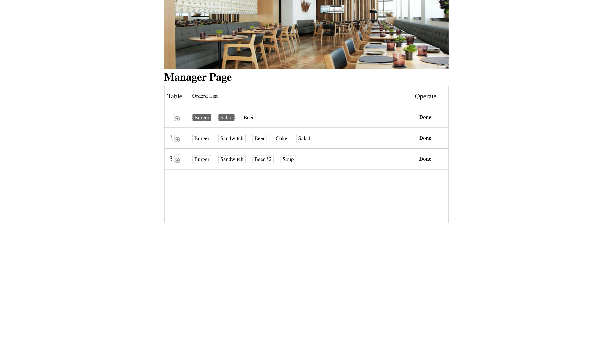
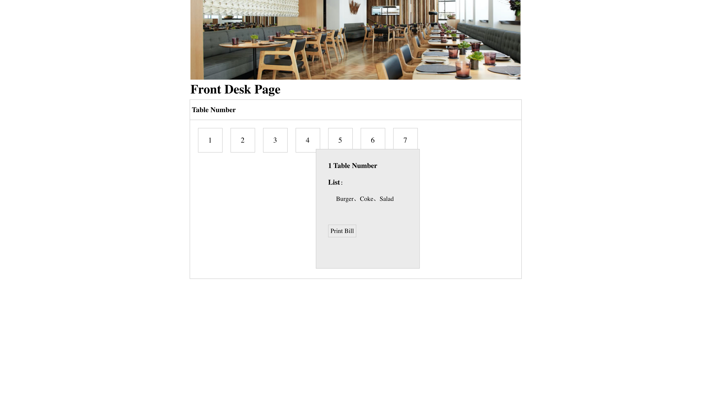
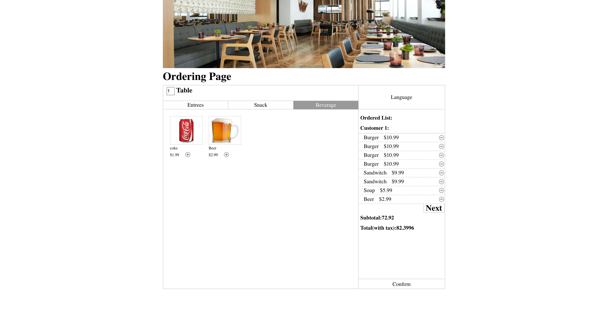

# Menu-Table-Mange Application

Three Simple  indicidual HTML pages to simulate different functionality for canteen 

## About

1. Ordering Page: Target to customer, dispay a menu to the board, allow customer to do selection and present the price cost.
2. Front Desk Page: Target to Waiter/waitness, allow them to manager the table being used
3. Manager Page: Tatget to cashier, allow them to print the bill

## Screensots
#### Ordering Page

#### Front Desk Page

#### Manager Page

## Getting Started

Simply open html files

## License
[MIT License](LICENSE)
